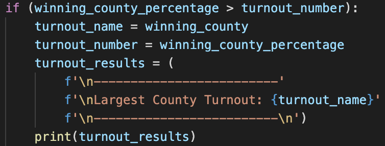
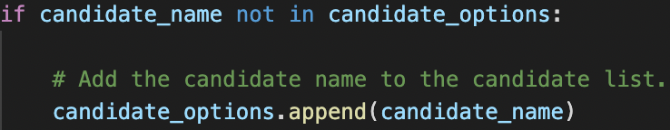

# Election Analysis

## Overview of Election Audit

In this analysis I am asked by Tom, a Colorado Board of Elections employee to audit the recent local congressional election. The election data is retrieved from voters who cast their votes through either mail-in ballot, punch cards, or direct-recording electronic machines. Using Python I am asked to compute:

1. The total number of votes cast.
2. The complete list of candidates who received votes and the total number of votes each candidate received.
3. The percentage of votes each candidate received.
4. The winner of the election according to popular vote.

I extracted the data of the election results from the csv file located in Resources and I printed the results on a text file located in Analysis. Using for loops I made the code concise and ran it smoothly to extract all the information I was asked for.

## Election Audit Results 
In this section, I will summarize the election results according to county and candidate. In this election, we recorded three counties: Jefferson, Denver, and Arapahoe. In these counties, three candidates competed: Charles Casper Stockham, Diana DeGette, and Raymon Anthony Doane.

1 - The total number of votes cast in this election was **369,711**. I calculated the total number of votes by skipping the first row and then running a for loop through the rest of the rows.  ***Image 1.1: Total Number of Votes*** 

2 - The election results according to the counties are as seen in image 1.2. The county that participated the most in the election is Denver (82.8%), followed by Jefferson (10.5%) and then Arapahoe (6.7%).

 

***Image 1.2: Election Results According to County*** 

3 - The county with the largest turnout was Denver with a percentage of 82.8% and a total popular vote of 306,055. To find this result I ran an 'if' condition iterating through all the values to get the highest turnout rate amount the counties. 

 

***Image 1.3: Finding Largest Turnout***  
  
4 - The election results according to the candidates are as seen in image 1.4. Stockham received 23%, DeGette received 73.8% and Doane received 3.1% of the votes.

 

***Image 1.4: Election Results According to Candidate***       

5 - The election was won by Diana DeGette with a landslide of 73.8%, receiving a total of 272,892 votes.  

***Image 1.5: Winning Candidate*** 

## Election Audit Summary 
The great thing about writing automated code is that it can be used anywhere with some modifications. This code can be used practically for any election with small modifications. The first modification I will suggest is by changing the file name the data is found in and the folder where the data is located in. In addition to this, you can also change the folder where you want to save the text.

 ***Image 1.6: Modification to Data***   

The second modification I would suggest is if you know the exact number of candidates in the election you can directly make a list of those names rather than iterate through the code as I did in this analysis, just as in image 1.7.

 ***Image 1.7: Modification to Data*** 

Moreover, the results can be formatted in a personalized to the business that wishes to purchase this code. 

## Challenge Overview 
The challenging part of this assignment for me was understanding the anatomy of the code; figuring out the logic of writing the code. I read more about Python on the internet before I started doing the challenge. I also tested myself by writing a three-round rock, paper, scissors match between me and the computer. I learned that experimenting with the code allowed me to understand what I wanted to do more thoroughly.

 

 
