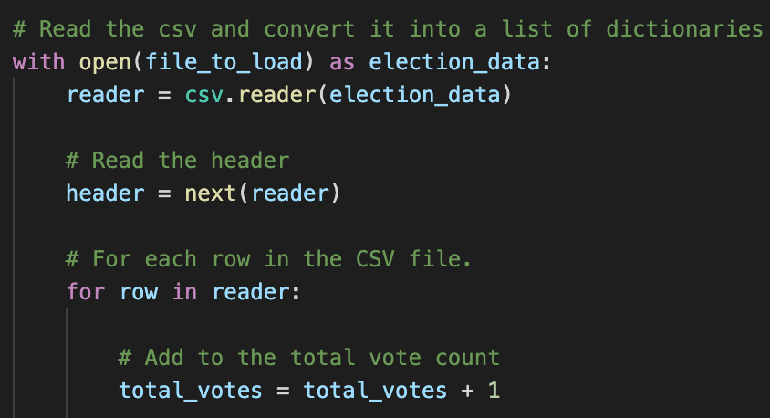
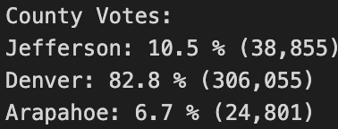
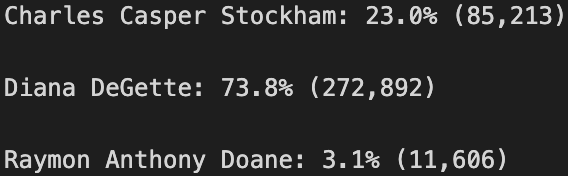
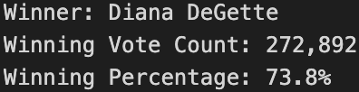
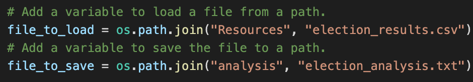

# Election Analysis

## Overview of Election Audit

In this analysis I am asked by Tom, a Colorado Board of Elections employee to audit the recent local congressional election. The election data is retrived from voters who cast their vote  through either mail-in ballot, punch cards or direct recording electronic machines. Using Python I am asked to compute: 

1. The total number of votes cast. 
2. The complete list of candidates who received votes and the total number of votes each candiate received. 
3. The percentage of votes each candidate received. 
4. The winner of the election according to popular vote. 

I extracted the data of the election results from the csv file located in Resources and I printed the results on a text file located in Analysis. Using for loops I made the code concise and ran it smoothly to extract all the information I was asked for. 

## Election Audit Results 
In this section I will summarize the election results according to county and candidate. In this election we reccorded three counties: Jefferson, Denver, and Arapahoe. In these counties three candidates competed: Charles Casper Stockham, Diana DeGette, and Raymon Anthony Doane.

1 - The total number of votes cast in this election was **369,711**. I calculated the total number of votes by skipping the first row and then running a for loop through the rest of the rows.  ***Image 1.1: Total Number of Votes*** 

2 - The election results according to county is as seen in image 1.3. The county that participated the most in the election is Denver (82.8%), followed by Jefferson (10.5%) and then Arapahoe (6.7%). 

 

***Image 1.2: Election Results According to County*** 

3 - The county with the largest turnout was Denver with a percentage of 82.8% and a total of 306,055 number of popular vote. 

4 - The election results according to the candidate's is as seen in image 1.4. Stockham received 23%, DeGette received 73.8% and Doane received 3.1% of the votes.

 

***Image 1.3: Election Results According to Candidate***       

5 -  The election was won by a landslide by Diana DeGette with 73.8%, receiving a total of 272,892 votes.  

***Image 1.4: Winning Candidate*** 

## Election Audit Summary 
This code can be used practically for any election with small modifications. The first modicfication I will suggest is by changing the file name the data is found in and the folder where the data is located in. 

 ***Image 1.5: Modification to Data***   

The second modification can be on how the text wants to be presented.  

## Challenge Overview 
The challenging part of this assignment for me was understanding the anatomy of the code; figuring out the logic of writing the code. I read more about Python on the internet before I started doing the challenge. I also tested myself by writing a three round rock, paper,scissors match between me and the computer. 

 

 
